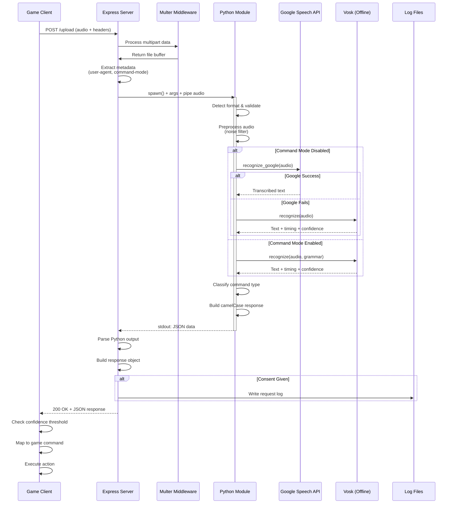
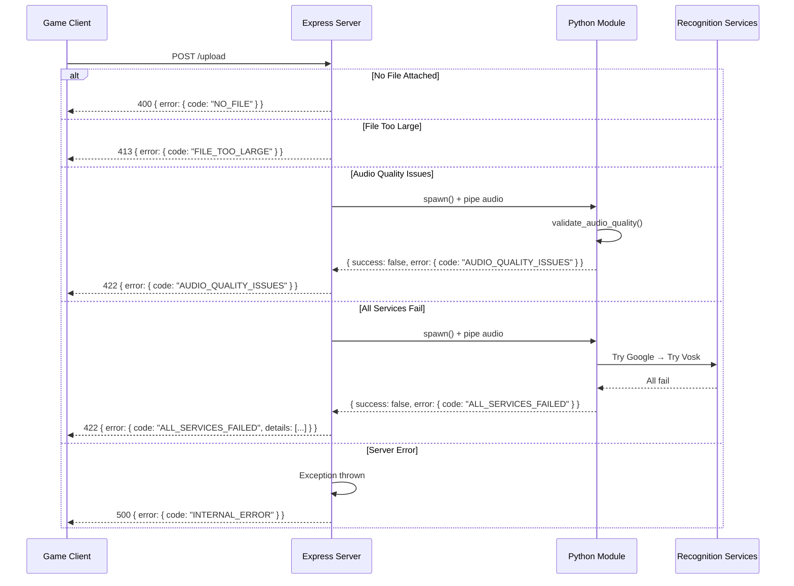
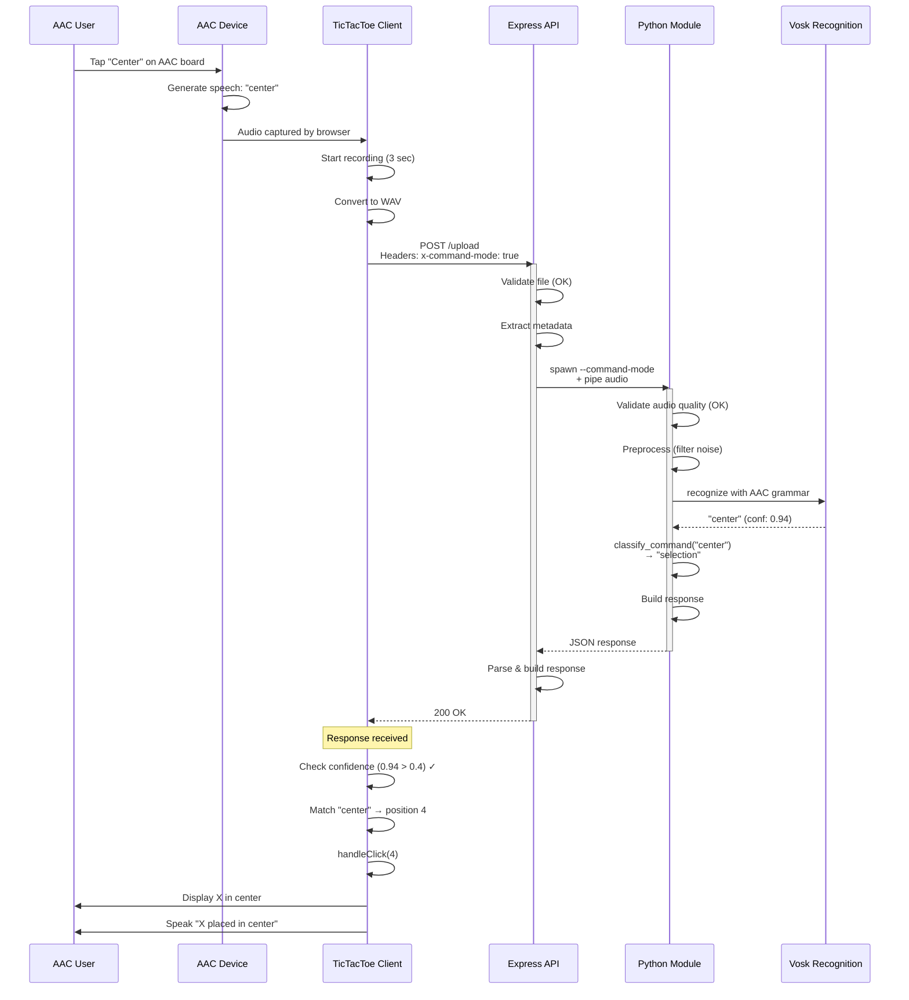
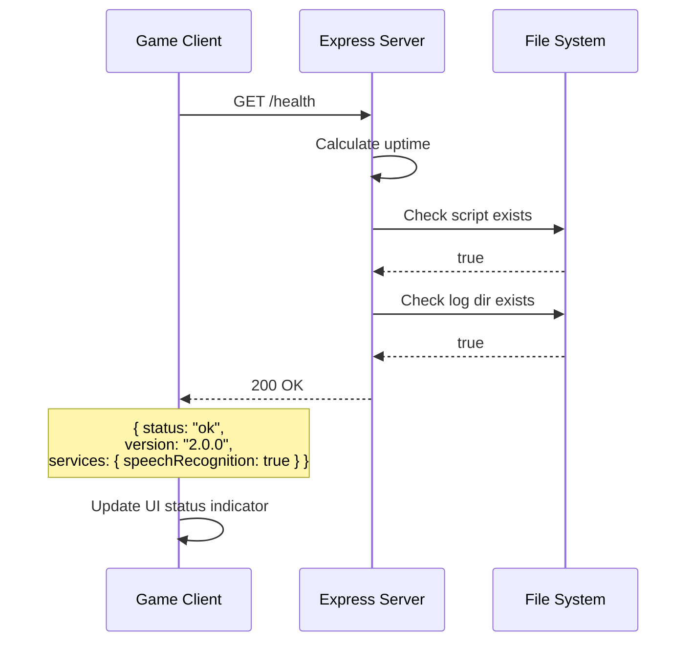
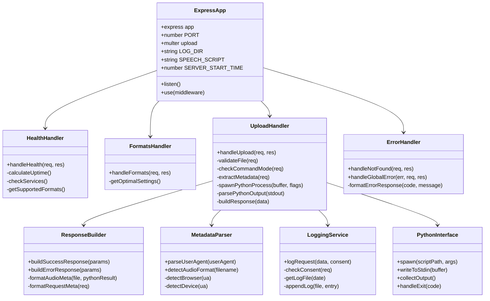
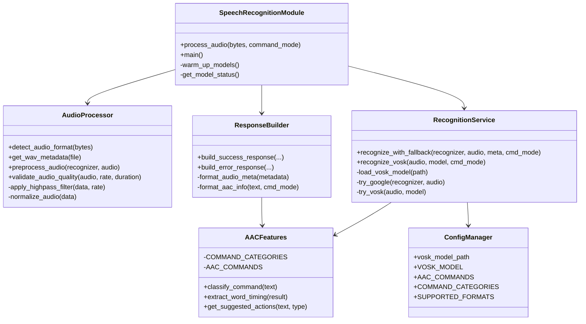
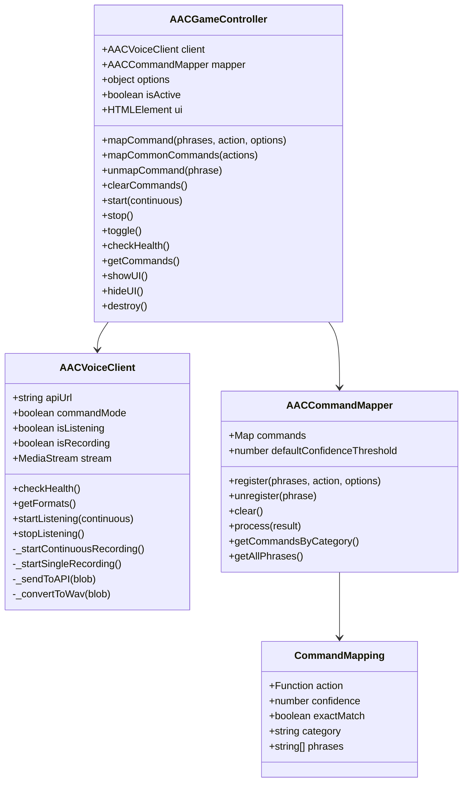

# Design Document - Part I: Architecture

## Purpose
The Design Document - Part I Architecture describes the software architecture and how the requirements are mapped into the design. This document combines diagrams and text that describes the system's components, their interactions, and the data flow through the AAC Integration API.

---

## System Architecture Overview

The AAC Integration API follows a **client-server architecture** with a **Python subprocess pipeline** for audio processing. The system is designed to be stateless, processing each audio upload request independently while maintaining optional logging capabilities for analytics.

### Key Features (v2.0.0)
- **Multiple Recognition Engines** - Google Speech Recognition with Vosk offline fallback
- **AAC Command Mode** - Optimized recognition for short commands
- **Word-Level Timing** - Start/end times for each recognized word
- **Standardized Responses** - Consistent camelCase JSON format
- **Health Monitoring** - Server status and service availability endpoints
- **Confidence Scoring** - Recognition confidence for filtering results


---

## API Endpoints Overview

| Method | Endpoint | Description |
|--------|----------|-------------|
| `GET` | `/health` | Server health, uptime, and service status |
| `GET` | `/formats` | Supported audio formats and optimal settings |
| `POST` | `/upload` | Audio upload and transcription |

---

## Component Architecture

### 1. Client Layer (Game Application)

**Technology**: JavaScript (Browser, Node.js, or React Native)

**Responsibilities**:
- Capture audio input from AAC devices or microphone
- Convert audio to WAV format (16kHz, 16-bit, mono recommended)
- Send HTTP requests to API endpoints
- Parse JSON responses (camelCase format)
- Map transcribed text to game commands
- Handle errors and provide user feedback
- Display confidence scores and processing times

**Key Interfaces**:
```javascript
// Health Check Request
GET /health
Response: {
  status: "ok",
  timestamp: string,
  uptime: number,
  uptimeFormatted: string,
  version: string,
  services: { speechRecognition: boolean, logging: boolean },
  supportedFormats: string[],
  endpoints: object
}

// Upload Request
POST /upload
Content-Type: multipart/form-data
Body: { audioFile: File }
Headers: {
  'x-command-mode'?: 'true' | 'false',
  'x-user-id'?: string,
  'x-session-id'?: string,
  'x-logging-consent'?: 'true' | 'false'
}

// Success Response (camelCase)
{
  success: true,
  transcription: string,
  confidence: number,          // 0-1
  service: string,             // "google" | "vosk"
  processingTimeMs: number,
  audio: {
    filename: string,
    size: number,
    sizeBytes: number,
    format: string,
    duration: number,
    sampleRate: number,
    channels: number,
    mimeType: string
  },
  request: {
    timestamp: string,
    device: string,
    browser: string,
    userAgent: string
  },
  aac: {
    commandMode: boolean,
    commandType: string | null,
    isCommand: boolean,
    suggestedActions?: string[]
  },
  wordTiming?: Array<{
    word: string,
    startTime: number,
    endTime: number,
    confidence: number
  }>,
  user?: { id: string },
  warnings?: string[]
}

// Error Response (camelCase)
{
  success: false,
  transcription: null,
  processingTimeMs: number,
  error: {
    code: string,
    message: string,
    details?: Array<{ service: string, error: string }>
  },
  request: { ... },
  audio?: { ... },
  warnings?: string[]
}
```

### 2. Server Layer (Express.js)

**Technology**: Node.js with Express framework

**File**: `index.js`

**Responsibilities**:
- Handle HTTP requests and routing
- Serve health and format information endpoints
- Process multipart/form-data uploads
- Validate file presence and size
- Spawn and manage Python subprocess
- Pass command mode flags to Python
- Parse user agent and device information
- Implement consent-based logging
- Build standardized camelCase JSON responses
- Handle 404 routes with helpful error messages
- Global error handling for unexpected exceptions

**Key Modules**:
```javascript
// Core Modules
const express = require('express');
const multer = require('multer');
const cors = require('cors');
const fs = require('fs');
const { spawn } = require('child_process');
const path = require('path');

// Configuration
const PORT = process.env.PORT || 8080;
const storage = multer.memoryStorage();
const upload = multer({ 
  storage,
  limits: { fileSize: 10 * 1024 * 1024 } // 10MB limit
});
const LOG_DIR = path.join(__dirname, 'logs');
const SPEECH_SCRIPT = path.join(__dirname, 'speechRecognition.py');
const SERVER_START_TIME = Date.now();
```

**Helper Functions**:
- `parseUserAgent(userAgent)` - Extracts browser and device type
- `detectAudioFormat(filename)` - Detects format from file extension
- `logRequest(data, consentGiven)` - Writes request logs to JSON files
- `buildSuccessResponse(params)` - Constructs standardized success response
- `buildErrorResponse(params)` - Constructs standardized error response
- `parsePythonOutput(output)` - Parses Python JSON with backwards compatibility

**Route Handlers**:
```javascript
// Health check endpoint
app.get('/health', (req, res) => {
  // Returns server status, uptime, services, supported formats
});

// Supported formats endpoint
app.get('/formats', (req, res) => {
  // Returns format list and optimal settings
});

// Audio upload and transcription
app.post('/upload', upload.single("audioFile"), async (req, res) => {
  // 1. Validate file presence
  // 2. Check command mode header
  // 3. Extract metadata
  // 4. Spawn Python process with flags
  // 5. Pipe audio buffer to Python stdin
  // 6. Collect stdout/stderr
  // 7. Parse JSON response
  // 8. Build standardized response
  // 9. Log with consent
  // 10. Return response
});

// 404 handler
app.use((req, res) => {
  // Returns available endpoints
});

// Global error handler
app.use((err, req, res, next) => {
  // Handles multer errors, unexpected exceptions
});
```

### 3. Audio Processing Layer (Python)

**Technology**: Python 3.8+ with SpeechRecognition, Vosk, NumPy, SciPy

**File**: `speechRecognition.py`

**Responsibilities**:
- Read audio data from stdin
- Detect audio format from file headers
- Extract audio metadata (duration, sample rate, channels)
- Validate audio quality (duration, volume, sample rate)
- Apply audio preprocessing (high-pass filter for noise reduction)
- Perform speech-to-text with fallback chain
- Support AAC command mode with limited vocabulary
- Extract word-level timing information
- Classify commands into AAC categories
- Return standardized camelCase JSON response

**Module Structure**:
```python
# Core Classes/Functions
class AACVoiceClient:       # Low-level API communication
class AACCommandMapper:     # Maps phrases to actions  
class AACGameController:    # High-level game integration

# Audio Processing
def detect_audio_format(audio_bytes) -> str
def get_wav_metadata(audio_file) -> dict
def preprocess_audio(recognizer, audio) -> AudioData
def validate_audio_quality(audio, sample_rate, duration) -> dict

# Speech Recognition
def load_vosk_model(model_path) -> Model
def recognize_vosk(audio_data, model, command_mode) -> tuple
def recognize_with_fallback(recognizer, audio, metadata, command_mode) -> dict

# AAC Features
def classify_command(text) -> str
def extract_word_timing(vosk_result) -> list
def get_suggested_actions(text, command_type) -> list

# Response Builders
def build_success_response(...) -> dict
def build_error_response(...) -> dict

# Entry Points
def process_audio(audio_bytes, command_mode, skip_preprocessing) -> dict
def main()  # CLI entry point
```

**Recognition Fallback Chain**:
```python
def recognize_with_fallback(recognizer, audio, metadata, command_mode):
    errors = []
    
    # 1. Try Google Speech Recognition (primary, more accurate)
    if not command_mode:  # Skip for command mode - Vosk is faster
        try:
            text = recognizer.recognize_google(audio)
            return build_success_response(text, "google", ...)
        except Exception as e:
            errors.append({"service": "google", "error": str(e)})
    
    # 2. Try Vosk offline recognition (fallback, works offline)
    try:
        text, confidence, result = recognize_vosk(audio, model, command_mode)
        if text:
            return build_success_response(text, "vosk", confidence, ...)
    except Exception as e:
        errors.append({"service": "vosk", "error": str(e)})
    
    # 3. All services failed
    return build_error_response("ALL_SERVICES_FAILED", errors, ...)
```

**AAC Command Categories**:
```python
COMMAND_CATEGORIES = {
    "navigation": ["back", "next", "previous", "home", "menu", "exit", 
                   "up", "down", "left", "right"],
    "selection":  ["select", "choose", "pick", "open", "close", 
                   "cancel", "confirm", "delete", "yes", "no"],
    "communication": ["hello", "goodbye", "thank you", "please", 
                      "sorry", "wait", "more", "done", "help"],
    "media": ["play", "pause", "stop", "repeat", "louder", "quieter"]
}
```

**Audio Preprocessing Pipeline**:
```python
def preprocess_audio(recognizer, audio):
    # 1. Convert to numpy array
    raw_data = np.frombuffer(audio.frame_data, np.int16)
    
    # 2. Apply high-pass filter (remove < 80Hz noise)
    nyquist = audio.sample_rate / 2
    normal_cutoff = 80 / nyquist
    b, a = signal.butter(4, normal_cutoff, btype='high')
    filtered_data = signal.filtfilt(b, a, raw_data)
    
    # 3. Normalize to prevent clipping
    max_val = np.max(np.abs(filtered_data))
    if max_val > 0:
        filtered_data = filtered_data * (32767 * 0.9 / max_val)
    
    # 4. Return processed AudioData
    return sr.AudioData(filtered_data.astype(np.int16).tobytes(), ...)
```

### 4. External Service Layer

**Primary Service**: Google Speech Recognition API
- Accessed through Python's `speech_recognition` library
- Higher accuracy for general speech
- Requires internet connection
- No API key needed for basic usage

**Fallback Service**: Vosk Offline Recognition
- Local speech recognition using pre-trained models
- Works without internet connection
- Faster for short commands
- Provides word-level timing and confidence
- Supports custom vocabulary/grammar

**Model Configuration**:
```python
# Vosk model path (configurable via environment)
vosk_model_path = os.environ.get(
    'VOSK_MODEL_PATH', 
    'model/vosk-model-small-en-us-0.15'
)

# Model caching for performance
VOSK_MODEL = None  # Global cache

def load_vosk_model(model_path):
    global VOSK_MODEL
    if VOSK_MODEL is not None:
        return VOSK_MODEL  # Return cached model
    # ... load model
    VOSK_MODEL = vosk.Model(model_path)
    return VOSK_MODEL
```

---

## Data Flow Diagrams

### Successful Request Flow


### Error Handling Flow


### Complete Use Case: AAC User Playing TicTacToe


### Health Check Flow


---

## Class Diagrams

### Express Server Architecture


### Python Module Architecture


### Client Integration Module


---

## Database Design

**Current Status**: The API uses **file-based logging** for request tracking and analytics. No traditional database is required.

### Log File Structure

**Location**: `Initial_API/logs/`

**Format**: JSON array per daily log file

**Filename Pattern**: `requests-YYYY-MM-DD.json`

**Schema (v2.0.0)**:
```json
[
  {
    "timestamp": "2025-01-15T14:23:45.123Z",
    "success": true,
    "transcription": "center",
    "confidence": 0.94,
    "service": "vosk",
    "processingTimeMs": 245,
    "audio": {
      "filename": "recording.wav",
      "size": 32000,
      "sizeBytes": 32000,
      "format": "WAV",
      "duration": 1.5,
      "sampleRate": 16000,
      "channels": 1,
      "mimeType": "audio/wav"
    },
    "request": {
      "timestamp": "2025-01-15T14:23:43.000Z",
      "device": "Desktop",
      "browser": "Chrome",
      "userAgent": "Mozilla/5.0..."
    },
    "aac": {
      "commandMode": true,
      "commandType": "selection",
      "isCommand": true
    },
    "user": {
      "id": "user123"
    },
    "audioBufferSize": 32000,
    "ipAddress": "::1"
  }
]
```


---

## Algorithms and Processing Logic

### 1. Audio Format Detection Algorithm

**Location**: `speechRecognition.py` - `detect_audio_format()`

**Purpose**: Identify audio format from magic bytes (file signature)

```python
def detect_audio_format(audio_bytes: bytes) -> str:
    """Detect audio format from byte stream."""
    if len(audio_bytes) < 12:
        return 'UNKNOWN'
    
    # Check magic bytes
    if audio_bytes.startswith(b'RIFF') and audio_bytes[8:12] == b'WAVE':
        return 'WAV'
    elif audio_bytes[0:3] == b'ID3' or audio_bytes[0:2] == b'\xff\xfb':
        return 'MP3'
    elif audio_bytes[0:4] == b'fLaC':
        return 'FLAC'
    elif audio_bytes[0:4] == b'OggS':
        return 'OGG'
    else:
        return 'UNKNOWN'
```

**Magic Bytes Reference**:
| Format | Magic Bytes | Hex |
|--------|-------------|-----|
| WAV | `RIFF....WAVE` | `52 49 46 46 xx xx xx xx 57 41 56 45` |
| MP3 | `ID3` or `ÿû` | `49 44 33` or `FF FB` |
| FLAC | `fLaC` | `66 4C 61 43` |
| OGG | `OggS` | `4F 67 67 53` |

### 2. Audio Quality Validation Algorithm

**Location**: `speechRecognition.py` - `validate_audio_quality()`

**Purpose**: Ensure audio meets minimum quality requirements for recognition

```python
def validate_audio_quality(audio, sample_rate, duration):
    issues = []
    warnings = []
    
    # Duration checks
    if duration < 0.1:
        issues.append("Audio too short (< 0.1s)")
    elif duration < 0.3:
        warnings.append("Audio may be too short")
    elif duration > 30:
        warnings.append("Long audio may increase processing time")
    
    # Volume check (RMS)
    rms = audioop.rms(audio.frame_data, audio.sample_width)
    if rms < 50:
        issues.append("Audio appears silent")
    elif rms < 200:
        warnings.append("Audio volume is low")
    
    # Sample rate check
    if sample_rate < 8000:
        issues.append("Sample rate too low (< 8kHz)")
    elif sample_rate < 16000:
        warnings.append("Sample rate below optimal (16kHz)")
    
    return {
        "valid": len(issues) == 0,
        "issues": issues,
        "warnings": warnings
    }
```

### 3. Audio Preprocessing Algorithm

**Location**: `speechRecognition.py` - `preprocess_audio()`

**Purpose**: Remove noise and normalize audio for better recognition

```python
def preprocess_audio(recognizer, audio):
    # Convert to numpy array
    raw_data = np.frombuffer(audio.frame_data, np.int16)
    
    # Design high-pass Butterworth filter
    nyquist = audio.sample_rate / 2
    cutoff = 80  # Remove frequencies below 80Hz
    normal_cutoff = cutoff / nyquist
    b, a = signal.butter(4, normal_cutoff, btype='high')
    
    # Apply zero-phase filtering
    filtered_data = signal.filtfilt(b, a, raw_data)
    
    # Normalize to prevent clipping
    max_val = np.max(np.abs(filtered_data))
    if max_val > 0:
        filtered_data = filtered_data * (32767 * 0.9 / max_val)
    
    # Clip to valid range
    filtered_data = np.clip(filtered_data, -32768, 32767)
    
    return sr.AudioData(
        filtered_data.astype(np.int16).tobytes(),
        audio.sample_rate,
        audio.sample_width
    )
```

### 4. Command Classification Algorithm

**Location**: `speechRecognition.py` - `classify_command()`

**Purpose**: Categorize recognized text into AAC command types

```python
def classify_command(text: str) -> Optional[str]:
    if not text:
        return None
    
    text_lower = text.lower().strip()
    words = text_lower.split()
    
    # Check each word against command categories
    for category, commands in COMMAND_CATEGORIES.items():
        for word in words:
            if word in commands:
                return category
    
    return "freeform"  # Not a recognized command
```

### 5. User Agent Parsing Algorithm

**Location**: `index.js` - `parseUserAgent()`

**Purpose**: Extract browser and device information from user-agent string

```javascript
function parseUserAgent(userAgent) {
    if (!userAgent) return { browser: 'Unknown', device: 'Unknown' };
    
    const ua = userAgent.toLowerCase();
    let browser = 'Unknown';
    let device = 'Unknown';
    
    // Browser detection (order matters for accuracy)
    if (ua.includes('edg')) browser = 'Edge';
    else if (ua.includes('chrome') && !ua.includes('edg')) browser = 'Chrome';
    else if (ua.includes('firefox')) browser = 'Firefox';
    else if (ua.includes('safari') && !ua.includes('chrome')) browser = 'Safari';
    else if (ua.includes('opera')) browser = 'Opera';
    
    // Device detection
    if (ua.includes('mobile') || ua.includes('android') || ua.includes('iphone')) {
        device = 'Mobile';
    } else if (ua.includes('tablet') || ua.includes('ipad')) {
        device = 'Tablet';
    } else {
        device = 'Desktop';
    }
    
    return { browser, device };
}
```

### 6. Confidence-Based Command Matching

**Location**: `aac-voice-control.js` - `AACCommandMapper.process()`

**Purpose**: Match transcription to commands with confidence filtering

```javascript
process(result) {
    const text = result.text.toLowerCase().trim();
    const confidence = result.confidence || 0;
    
    // Try exact match first
    if (this.commands.has(text)) {
        const cmd = this.commands.get(text);
        if (confidence >= cmd.confidence) {
            cmd.action(result);
            return { matched: true, phrase: text, type: 'exact' };
        }
    }
    
    // Try partial match
    for (const [phrase, cmd] of this.commands) {
        if (cmd.exactMatch) continue;
        
        if (text.includes(phrase) && confidence >= cmd.confidence) {
            cmd.action(result);
            return { matched: true, phrase, type: 'partial' };
        }
    }
    
    return { matched: false, text };
}
```

---

## Security Considerations

### 1. Input Validation
- **File presence check**: Returns 400 error if no file uploaded
- **File size limit**: 10MB maximum (configurable via Multer)
- **Format validation**: Python validates audio headers before processing
- **Audio quality validation**: Rejects silent or corrupted audio

### 2. Data Privacy
- **Consent-based logging**: No data stored without explicit permission
- **Production mode**: Auto-consent disabled in production environment
- **IP handling**: Consider hashing IPs before logging in production
- **GDPR compliance**: User data deletable by removing log files
- **No persistent storage**: Audio not saved to disk (memory only)

### 3. API Security
- **CORS enabled**: Configure allowed origins for production
- **No authentication**: Open API (add API keys/OAuth for production)
- **Rate limiting**: Implement for production deployments
- **File type restrictions**: Only audio MIME types accepted

### 4. Subprocess Security
- **Fixed script path**: No user-controlled script execution
- **Stdin-only input**: No file system access from user data
- **Process isolation**: Python runs in separate process
- **Timeout handling**: Processes killed after timeout

### 5. Recommended Production Hardening
```javascript
// Add to production deployment
const rateLimit = require('express-rate-limit');
const helmet = require('helmet');

app.use(helmet());
app.use(rateLimit({
    windowMs: 15 * 60 * 1000, // 15 minutes
    max: 100 // limit each IP to 100 requests per window
}));

// Restrict CORS
app.use(cors({
    origin: ['https://yourdomain.com'],
    methods: ['GET', 'POST']
}));
```

---

## Performance Considerations

### 1. Memory Usage
- **In-memory buffers**: Multer stores files in RAM (fast, limited by server memory)
- **Streaming**: Audio piped to Python via stdin (no disk I/O)
- **Model caching**: Vosk model loaded once, reused across requests
- **Garbage collection**: Buffers released after request completion

### 2. Concurrency
- **Async I/O**: Node.js event loop handles concurrent requests
- **Subprocess per request**: Each request spawns new Python process
- **Model preloading**: Vosk model warmed up on server start
- **Non-blocking**: Server responsive during Python processing

### 3. Response Times
| Scenario | Typical Time |
|----------|--------------|
| Health check | < 10ms |
| Short command (1-2s audio, Vosk) | 200-500ms |
| Short command (1-2s audio, Google) | 500-1500ms |
| Long audio (10-20s, Google) | 2-5s |
| Model cold start (first request) | +2-3s |

### 4. Optimization Strategies
- **Enable command mode** for AAC applications (faster Vosk recognition)
- **Preload Vosk model** on server startup (`PRELOAD_VOSK=true`)
- **Use WAV format** (no transcoding needed)
- **Optimal audio settings**: 16kHz, 16-bit, mono
- **Client-side VAD**: Only send audio with speech detected

---

## Deployment Architecture

### Development Environment
```
┌─────────────────────────────────────┐
│       Developer Machine             │
├─────────────────────────────────────┤
│ • Node.js + Express (localhost:8080)│
│ • Python 3.8+ with dependencies     │
│ • Vosk model (optional)             │
│ • Test audio files                  │
│ • Git repository                    │
└─────────────────────────────────────┘
```

### Production Environment (Recommended)
```
┌─────────────────────────────────────────────────────────┐
│                     Internet                            │
└────────────────────────┬────────────────────────────────┘
                         │
                         ▼
┌─────────────────────────────────────────────────────────┐
│              Load Balancer (nginx/ALB)                  │
│              • SSL termination                          │
│              • Rate limiting                            │
│              • Health checks                            │
└────────────────────────┬────────────────────────────────┘
                         │
         ┌───────────────┼───────────────┐
         ▼               ▼               ▼
┌─────────────┐  ┌─────────────┐  ┌─────────────┐
│   App 1     │  │   App 2     │  │   App 3     │
│ (Express +  │  │ (Express +  │  │ (Express +  │
│  Python)    │  │  Python)    │  │  Python)    │
└──────┬──────┘  └──────┬──────┘  └──────┬──────┘
       │                │                │
       └────────────────┼────────────────┘
                        │
                        ▼
┌─────────────────────────────────────────────────────────┐
│           Shared Storage (S3 / EFS / NFS)               │
│           • Vosk model files                            │
│           • Log files (optional)                        │
└─────────────────────────────────────────────────────────┘
```

### Docker Deployment
```dockerfile
# Dockerfile
FROM node:18-slim

# Install Python and dependencies
RUN apt-get update && apt-get install -y \
    python3 python3-pip \
    && rm -rf /var/lib/apt/lists/*

WORKDIR /app

# Install Node dependencies
COPY package*.json ./
RUN npm ci --only=production

# Install Python dependencies
RUN pip3 install --break-system-packages \
    SpeechRecognition vosk numpy scipy

# Copy application
COPY . .

# Download Vosk model (optional, or mount as volume)
# RUN mkdir -p model && wget -O model.zip ... && unzip ...

EXPOSE 8080

CMD ["node", "index.js"]
```

---

## Summary

The AAC Integration API v2.0.0 implements a **three-tier architecture**:

1. **Client Layer**: Game applications that capture audio, send HTTP requests, and execute commands based on transcription
2. **Server Layer**: Express.js API that handles uploads, manages subprocesses, and returns standardized responses
3. **Processing Layer**: Python module with multi-service recognition, audio preprocessing, and AAC-specific features

### Key Architectural Decisions

| Decision | Rationale |
|----------|-----------|
| RESTful API | Simplicity, broad client compatibility |
| Subprocess architecture | Language flexibility (Node.js + Python) |
| Multi-service fallback | Reliability (Google + Vosk offline) |
| camelCase JSON | JavaScript convention, consistent format |
| Command mode | Optimized for AAC use case |
| File-based logging | Development simplicity, no DB setup |
| Consent-based collection | Privacy compliance (GDPR) |
| Word-level timing | Visual feedback, accessibility features |

### Version History

| Version | Changes |
|---------|---------|
| 1.0.0 | Initial release with Google Speech Recognition |
| 2.0.0 | Added Vosk fallback, command mode, word timing, camelCase responses, health endpoint, audio preprocessing |

---
