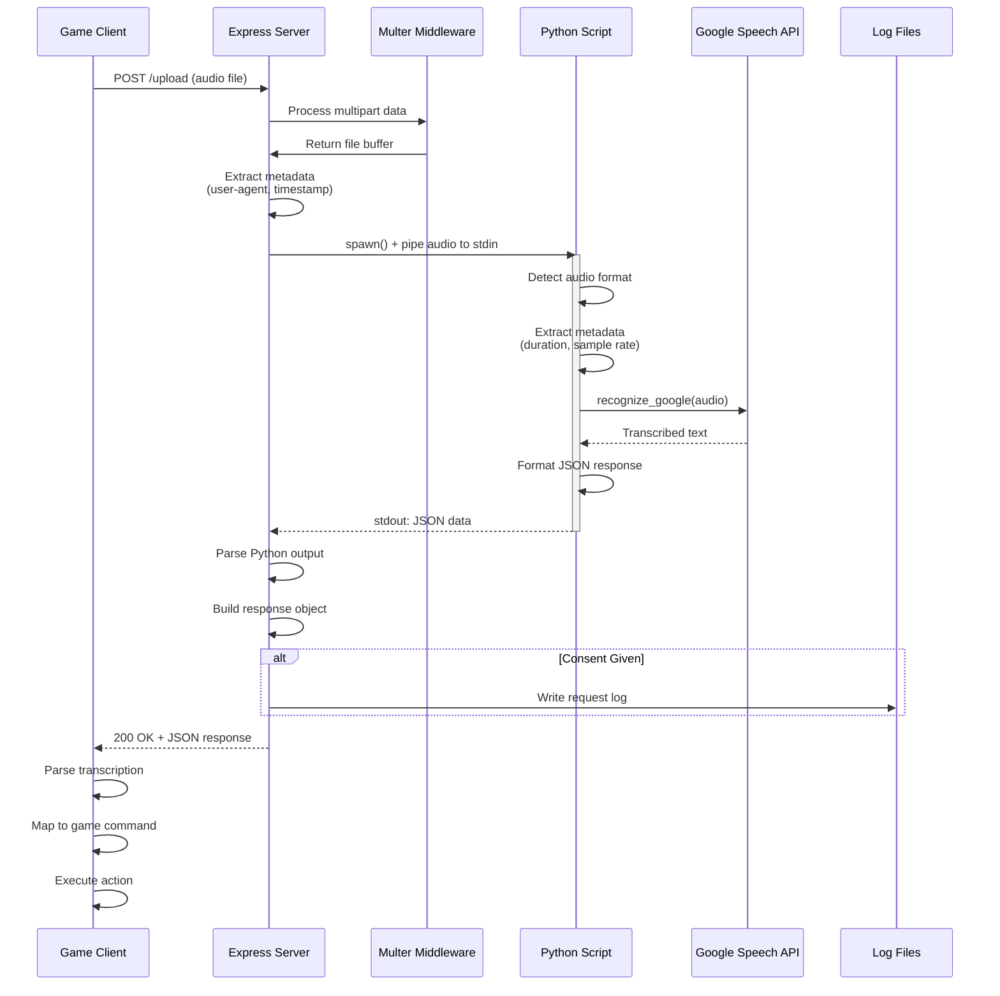
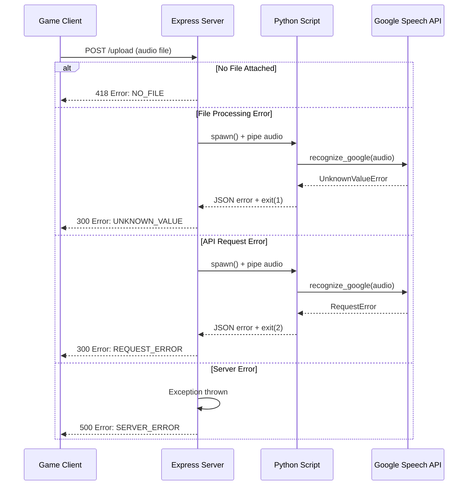
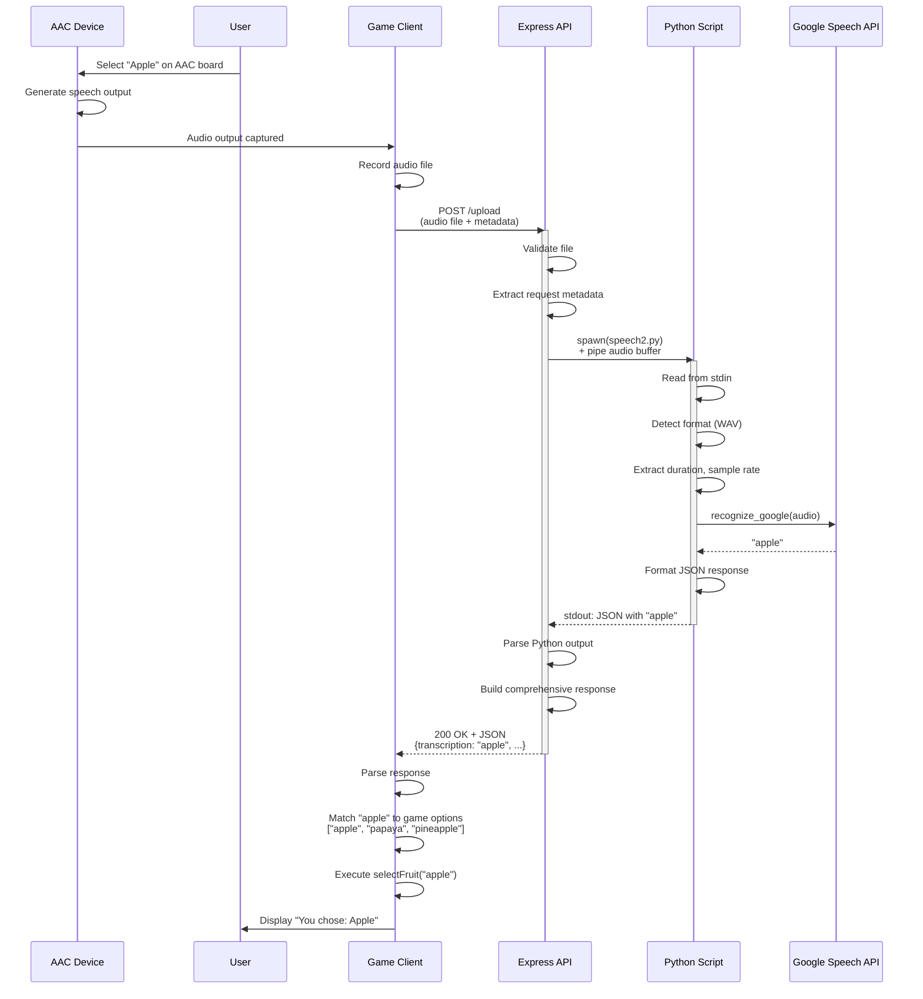
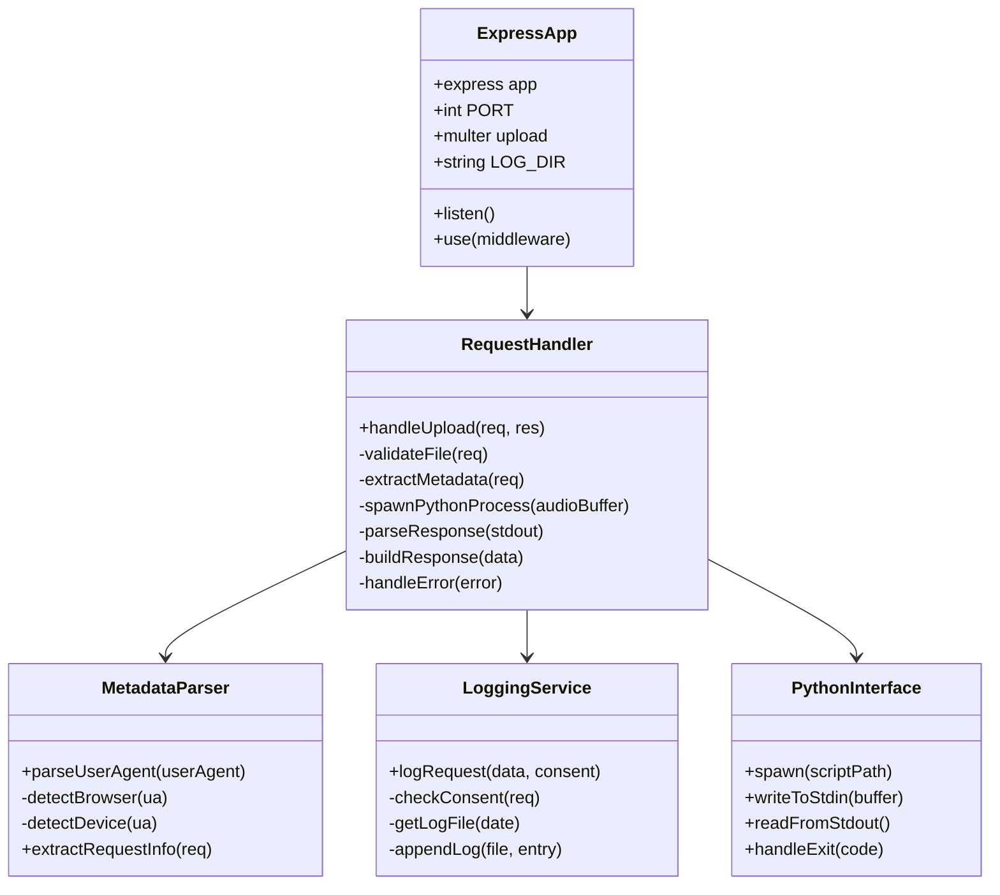
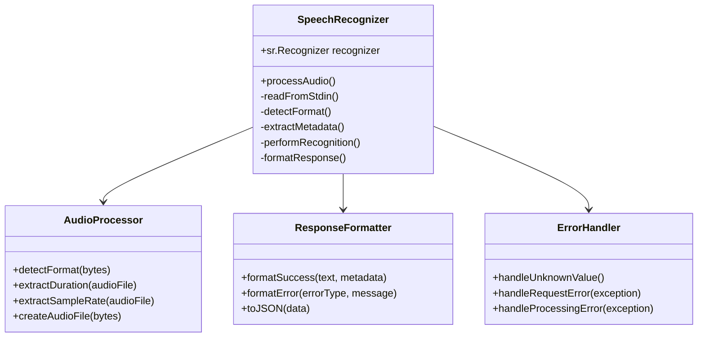
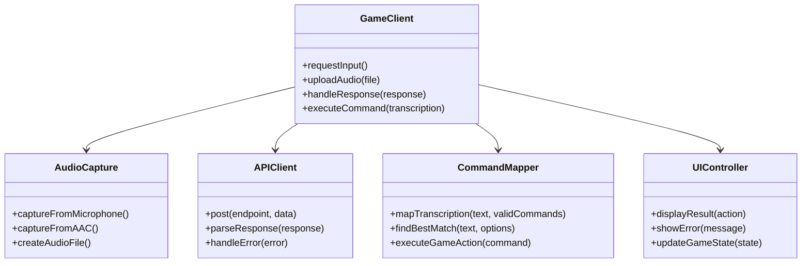
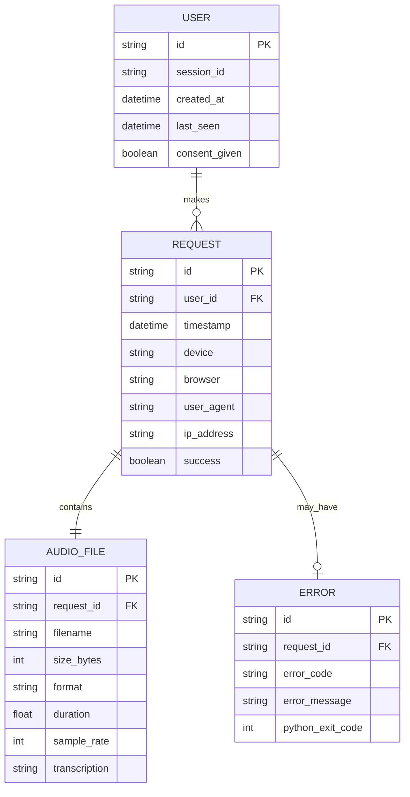

# Design Document - Part I: Architecture

## Purpose
The Design Document - Part I Architecture describes the software architecture and how the requirements are mapped into the design. This document combines diagrams and text that describes the system's components, their interactions, and the data flow through the AAC Integration API.

---

## System Architecture Overview

The AAC Integration API follows a **client-server architecture** with a **Python subprocess pipeline** for audio processing. The system is designed to be stateless, processing each audio upload request independently while maintaining optional logging capabilities for analytics.

### High-Level Architecture
```
┌─────────────────┐
│   Game Client   │ (Browser/Desktop App)
│  (JavaScript)   │
└────────┬────────┘
         │ HTTP POST
         │ multipart/form-data
         ▼
┌─────────────────┐
│  Express Server │ (Node.js)
│   Port: 8080    │
├─────────────────┤
│ • CORS Handling │
│ • File Upload   │
│ • Multer        │
│ • Metadata      │
│ • Logging       │
└────────┬────────┘
         │ spawn()
         │ stdin/stdout
         ▼
┌─────────────────┐
│ Python Script   │ (speech2.py)
│   (Subprocess)  │
├─────────────────┤
│ • Audio Format  │
│ • Detection     │
│ • Speech Recog. │
│ • Google API    │
└────────┬────────┘
         │ Network Call
         ▼
┌─────────────────┐
│  Google Speech  │
│ Recognition API │
└─────────────────┘
```

---

## Component Architecture

### 1. Client Layer (Game Application)

**Technology**: JavaScript (Browser or Node.js)

**Responsibilities**:
- Capture or receive audio input from AAC devices or microphone
- Format audio file for upload
- Send HTTP POST request to API endpoint
- Parse JSON response
- Map transcribed text to game commands
- Handle errors and provide user feedback

**Key Interfaces**:
```javascript
// Request Interface
POST /upload
Content-Type: multipart/form-data
Body: {
  audioFile: File,
  userId?: string,
  loggingConsent?: boolean
}
Headers: {
  'x-user-id'?: string,
  'x-session-id'?: string,
  'x-logging-consent'?: 'true' | 'false'
}

// Response Interface
{
  success: boolean,
  transcription: string | null,
  audio: AudioMetadata,
  request: RequestMetadata,
  user?: UserData,
  error?: ErrorData
}
```

### 2. Server Layer (Express.js)

**Technology**: Node.js with Express framework

**File**: `index.js`

**Responsibilities**:
- Handle HTTP requests and routing
- Process multipart/form-data uploads
- Spawn and manage Python subprocess
- Parse user agent and device information
- Implement consent-based logging
- Format comprehensive JSON responses
- Handle errors and exceptions

**Key Classes/Modules**:
```javascript
// Core Modules
const express = require('express');
const multer = require('multer');
const cors = require('cors');
const fs = require('fs');
const { spawn } = require('child_process');
const path = require('path');

// Configuration
const PORT = 8080;
const storage = multer.memoryStorage();
const upload = multer({ storage });
const LOG_DIR = path.join(__dirname, 'logs');
```

**Helper Functions**:
- `parseUserAgent(userAgent)` - Extracts browser and device type
- `logRequest(data, consentGiven)` - Writes request logs to JSON files

**Main Route Handler**:
```javascript
app.post('/upload', upload.single("audioFile"), async (req, res) => {
  // 1. Validate file presence
  // 2. Extract metadata
  // 3. Spawn Python process
  // 4. Pipe audio buffer to Python stdin
  // 5. Collect stdout/stderr
  // 6. Parse JSON response
  // 7. Log with consent
  // 8. Return structured response
});
```

### 3. Audio Processing Layer (Python)

**Technology**: Python 3.x with SpeechRecognition library

**File**: `speech2.py`

**Responsibilities**:
- Read audio data from stdin
- Detect audio format from file headers
- Extract audio metadata (duration, sample rate)
- Perform speech-to-text conversion
- Return structured JSON response
- Handle recognition errors gracefully

**Algorithm Flow**:
```python
1. Read audio bytes from stdin
2. Detect format (RIFF→WAV, fLaC→FLAC, FORM→AIFF)
3. Create BytesIO buffer
4. Open as AudioFile
5. Extract metadata (sample rate, duration)
6. Record audio data
7. Call recognizer.recognize_google(audio)
8. Format JSON response
9. Print to stdout
10. Exit with appropriate code
```

**Key Libraries**:
- `speech_recognition` - Core speech-to-text functionality
- `wave` - WAV file metadata extraction
- `io.BytesIO` - In-memory binary stream handling
- `json` - Response formatting

**Error Handling**:
```python
try:
    # Audio processing
except sr.UnknownValueError:
    # Could not understand audio
    exit(1)
except sr.RequestError:
    # API request failed
    exit(2)
except Exception:
    # General processing error
    exit(3)
```

### 4. External Service Layer

**Service**: Google Speech Recognition API

**Responsibilities**:
- Accept audio data via speech_recognition library
- Perform speech-to-text conversion
- Return recognized text or error

**Integration**: Accessed through Python's `speech_recognition` library, which handles API communication automatically.

---

## Data Flow Diagrams

### Successful Request Flow


### Error Handling Flow


### Complete Use Case: AAC User Playing Game


---

## Class Diagrams

### Express Server Architecture


### Python Script Architecture


### Client Integration Pattern


---

## Database Design

**Current Status**: The API does not use a traditional database. Instead, it implements **file-based logging** for request tracking and analytics.

### Log File Structure

**Location**: `Initial_API/logs/`

**Format**: JSON array per daily log file

**Filename Pattern**: `requests-YYYY-MM-DD.json`

**Schema**:
```json
[
  {
    "timestamp": "2025-11-10T14:23:45.123Z",
    "success": true,
    "transcription": "apple",
    "audio": {
      "filename": "recording.wav",
      "size": 44032,
      "format": "WAV",
      "duration": 2.5,
      "sampleRate": 44100
    },
    "request": {
      "timestamp": "2025-11-10T14:23:43.000Z",
      "device": "Desktop",
      "browser": "Chrome",
      "userAgent": "Mozilla/5.0..."
    },
    "user": {
      "id": "user123"
    },
    "audioBufferSize": 44032,
    "ipAddress": "::1"
  }
]
```

### Future Database Considerations

For production deployments requiring analytics, user tracking, or historical data analysis, consider:

**Recommended Database**: MongoDB or PostgreSQL

**Proposed Schema**:


---

## Algorithms and Processing Logic

### 1. Audio Format Detection Algorithm

**Location**: `speech2.py`

**Purpose**: Identify audio format from file header bytes
```python
def detect_format(audio_bytes):
    """
    Detect audio format from magic bytes (file signature)
    """
    if audio_bytes[:4] == b'RIFF':
        return "WAV"
    elif audio_bytes[:4] == b'fLaC':
        return "FLAC"
    elif audio_bytes[:4] == b'FORM':
        return "AIFF"
    else:
        return "WAV"  # Default fallback
```

**Magic Bytes Reference**:
- WAV: `52 49 46 46` (RIFF)
- FLAC: `66 4C 61 43` (fLaC)
- AIFF: `46 4F 52 4D` (FORM)

### 2. User Agent Parsing Algorithm

**Location**: `index.js` - `parseUserAgent()`

**Purpose**: Extract browser and device information from user-agent string
```javascript
function parseUserAgent(userAgent) {
    if (!userAgent) return { browser: 'Unknown', device: 'Unknown' };
    
    const ua = userAgent.toLowerCase();
    let browser = 'Unknown';
    let device = 'Unknown';
    
    // Browser detection (order matters - check specific before generic)
    if (ua.includes('edg')) browser = 'Edge';
    else if (ua.includes('chrome')) browser = 'Chrome';
    else if (ua.includes('firefox')) browser = 'Firefox';
    else if (ua.includes('safari')) browser = 'Safari';
    else if (ua.includes('opera')) browser = 'Opera';
    
    // Device detection
    if (ua.includes('mobile') || ua.includes('android') || ua.includes('iphone')) {
        device = 'Mobile';
    } else if (ua.includes('tablet') || ua.includes('ipad')) {
        device = 'Tablet';
    } else {
        device = 'Desktop';
    }
    
    return { browser, device };
}
```

### 3. Speech Recognition Pipeline

**Location**: `speech2.py`

**Library**: `speech_recognition` (Google Speech Recognition)

**Process**:
```python
# 1. Initialize recognizer
recognizer = sr.Recognizer()

# 2. Load audio from bytes
audio_file = io.BytesIO(audio_bytes)

# 3. Open as AudioFile context
with sr.AudioFile(audio_file) as source:
    # 4. Record audio data
    audio = recognizer.record(source)

# 5. Perform recognition
text = recognizer.recognize_google(audio)
```

**Training Data**: Uses Google's pre-trained speech recognition models (black box, not customizable in free tier)

**Accuracy Factors**:
- Audio quality (sample rate, bit depth)
- Background noise levels
- Speaker clarity and accent
- Audio duration (optimal: 1-30 seconds)

### 4. Consent-Based Logging Algorithm

**Location**: `index.js`

**Purpose**: Determine if request should be logged based on consent
```javascript
function shouldLog(req) {
    // Explicit consent via header
    if (req.get('x-logging-consent') === 'true') {
        return true;
    }
    
    // Explicit consent via body
    if (req.body.loggingConsent === true) {
        return true;
    }
    
    // Auto-consent in development (not production)
    if (process.env.NODE_ENV !== 'production') {
        return true;
    }
    
    // Default: no logging
    return false;
}
```

---

## Security Considerations

### 1. Input Validation
- **File presence check**: Returns 418 error if no file uploaded
- **Format validation**: Python script validates audio file headers
- **Size limits**: Configurable via Multer (currently unlimited, should be restricted in production)

### 2. Data Privacy
- **Consent-based logging**: No data stored without user permission
- **IP anonymization**: Consider hashing IP addresses before logging
- **GDPR compliance**: User data can be deleted by removing log files

### 3. API Security
- **CORS enabled**: Restricts which domains can access the API (configure allowed origins in production)
- **No authentication**: Currently open API (add API keys or OAuth for production)
- **Rate limiting**: Not implemented (recommended for production)

### 4. Subprocess Security
- **Fixed Python script path**: No user-controlled script execution
- **Stdin-only communication**: No file system access from user input
- **Process isolation**: Python subprocess runs independently

---

## Performance Considerations

### 1. Memory Usage
- **In-memory buffers**: Multer stores files in RAM (faster but limited by server memory)
- **Streaming**: Audio data streamed to Python via stdin (no disk I/O)
- **Garbage collection**: Buffers released after request completion

### 2. Concurrency
- **Async I/O**: Node.js handles multiple concurrent requests
- **Subprocess pooling**: Each request spawns new Python process (consider process pooling for high traffic)
- **Non-blocking**: Server remains responsive during Python processing

### 3. Response Times
- **Typical**: 2-5 seconds for 10-20 second audio clips
- **Factors**:
  - Audio duration
  - Google API latency
  - Network speed
  - Server load

---

## Deployment Architecture

### Development Environment
```
┌─────────────────────────────────┐
│   Developer Machine             │
├─────────────────────────────────┤
│ Node.js (localhost:8080)        │
│ Python 3.x                      │
│ Test audio files                │
│ Git repository                  │
└─────────────────────────────────┘
```

### Production Environment (Recommended)
```
┌─────────────────┐
│  Load Balancer  │
│   (nginx/ALB)   │
└────────┬────────┘
         │
    ┌────┴────┐
    │         │
┌───▼───┐ ┌──▼────┐
│ App 1 │ │ App 2 │  (Express + Python)
└───┬───┘ └──┬────┘
    │         │
    └────┬────┘
         │
┌────────▼────────┐
│  Log Storage    │
│  (S3 / EFS)     │
└─────────────────┘
```

---

## Summary

The AAC Integration API implements a **three-tier architecture**:

1. **Client Layer**: Game applications that capture audio and send HTTP requests
2. **Server Layer**: Express.js API that handles uploads, manages subprocesses, and formats responses
3. **Processing Layer**: Python script that performs speech-to-text conversion via Google's API

The system is designed to be **stateless**, **scalable**, and **privacy-conscious**, with comprehensive error handling and metadata tracking. The modular design allows for future enhancements such as real-time streaming, custom speech models, and direct AAC board integration.

**Key Architectural Decisions**:
- RESTful API for simplicity and broad compatibility
- Subprocess architecture for language flexibility (Node.js + Python)
- File-based logging for development simplicity
- Consent-based data collection for privacy compliance
- Comprehensive metadata for debugging and analytics

---

